# Human Health Digital Twin

A software-only digital twin of a person's physiology. It keeps a live, structured model of one person in sync with incoming readings. Each reading is compared with what that person's own body normally does at that activity level, abnormal changes are flagged with a plain-language reason, the state is shown on an **interactive 3D anatomical body built from real scan data**, and what-if scenarios run on the person's personal model.

It runs on two kinds of data, through the same engine:

- **Live simulated data**: a seeded physiology simulator for a synthetic person, for a controllable demo.
- **Real wearable data**: upload a Fitbit, Samsung Health or Google Fit export, or try the bundled **real public Fitbit dataset** (14 days of one consenting participant, CC0). The twin learns that person's baseline and flags what is unusual *for them*.
- **Your Android phone, live**: the **Health Twin** companion app reads Android Health Connect (phone plus most smartwatches: steps, heart rate, SpO₂, breathing, temperature, sleep) and syncs to the twin over Wi-Fi every minute. Pair by scanning a QR code on the website. See [docs/mobile.md](docs/mobile.md).

> **Research and demonstration prototype.** This is not a medical device. States and flags describe the data; they are not diagnoses, and nothing here is treatment advice.

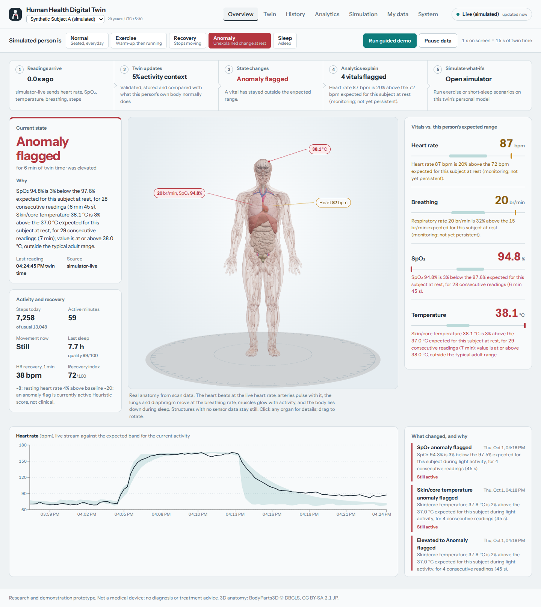

**Quick start (Windows):** double-click **`run.bat`**. **macOS/Linux:** `./run.sh`. The browser opens <http://localhost:8000>; press **Run guided demo**, or open **My data → Load real Fitbit sample**, or **My data → Connect your Android phone**. You need Python 3.11+; Node.js is only needed if `frontend/dist` is missing. Docker and manual setup are [below](#13-installation).

---

## Submission information

Everything the Happiest Health submission form asks for is in this section, in the same order as the form.

| Required item | Where |
|---|---|
| Team details | [Team details](#team-details) |
| College / incubator information | [College / incubator information](#college--incubator-information) |
| Project title | [Project title](#project-title) |
| Problem statement | [Problem statement (summary)](#problem-statement-summary), in full in [§2](#2-problem-statement) |
| Healthcare use case | [Healthcare use case](#healthcare-use-case) |
| Technical stack | [Technical stack (summary)](#technical-stack-summary), in full in [§8](#8-technology-stack) |
| AI/ML model or framework details | [AI/ML model and framework details](#aiml-model-and-framework-details) |
| 15–20 minute demo video (unlisted YouTube) | [Demo video](#demo-video) |
| Open-source licence details | [Open-source licence details](#open-source-licence-details) |
| Architecture diagram (PDF) | [docs/submission/architecture-diagram.pdf](docs/submission/architecture-diagram.pdf) |
| Presentation (PDF) | [docs/submission/presentation.pdf](docs/submission/presentation.pdf) |
| Public access | [Public access](#public-access) |

### Team details

| Role | Name | Department / year | Email | GitHub |
|---|---|---|---|---|
| Team lead | [Team lead name] | [Dept, year] | [email] | [@Baranidharan16](https://github.com/Baranidharan16) |
| Member | [Member 2 name] | [Dept, year] | [email] | [GitHub] |
| Member | [Member 3 name] | [Dept, year] | [email] | [GitHub] |

**Team name:** [Team name]

Contributions of each member are listed in [§22](#22-team-contributions).

### College / incubator information

| | |
|---|---|
| College / incubator | [College / incubator name] |
| Department | [Department] |
| City, State | [City, State] |
| Faculty mentor (if any) | [Mentor name or 'None'] |

### Project title

**Human Health Digital Twin: a personal, explainable digital twin of human physiology with an interactive 3D anatomical body, live phone/smartwatch data and what-if simulation.**

### Problem statement (summary)

Wearables already measure heart rate, SpO₂, temperature, breathing, movement and sleep continuously, but most apps judge every person against the same population thresholds. That raises **false alarms during normal activity** (150 bpm while running) and **misses changes that are large for one person** (a resting heart rate of 85 bpm is "normal", yet it is a 29% rise for someone whose own resting rate is 66). There is no living **model of the individual** that knows their normal, understands context, explains what changed, and can answer "what if?". This project builds that model: a digital twin of one person, kept in sync with their data. Full statement in [§2](#2-problem-statement).

### Healthcare use case

**Primary use case: personal preventive wellness monitoring.** A person wears any smartwatch or simply carries an Android phone. The Health Twin app syncs their data (through Android Health Connect) to their twin. The twin learns *their* normal resting heart rate, breathing, SpO₂, temperature, activity and sleep, and then:

1. **Flags unusual changes early and explains them.** For example: *"Resting heart rate 88 bpm is 24% above the 71 bpm expected for you at rest, for 4 consecutive readings."* A sustained rise like this can come with poor recovery, overtraining, stress, dehydration or the start of an illness, so the person knows to rest, re-check, or talk to a doctor.
2. **Avoids false alarms** during exercise and sleep, because expectations follow what the person is doing.
3. **Shows the body, not just numbers.** On the 3D anatomical twin the heart beats at the live heart rate, the lungs breathe at the live breathing rate, and the organ behind a flagged vital lights up. This makes the data understandable for people without medical training.
4. **Answers "what if?".** For example, *"How long will I take to recover from a 30-minute run after a 5-hour night?"* The answer comes from the person's own calibrated model.

**Other healthcare scenarios the same twin supports:**

| Who | Scenario | How the twin helps |
|---|---|---|
| Family caregivers | An elderly parent living alone wears a watch | Their phone syncs to the twin; the family sees "stable / sleeping / unusual for her" with a plain-language reason, instead of raw numbers |
| Fitness and recovery | Training plans, return to exercise | Recovery state, 1-minute heart-rate recovery, sleep-restriction what-ifs |
| Clinics and health programmes (future, after validation) | Pre-visit or remote-programme review | A summary of the person's trends, flagged episodes and time in each state, rather than isolated readings |
| Researchers | Wearable-data studies | Imports Fitbit / Samsung Health / Google Fit exports, with reproducible baselines and validation metrics |

**Boundaries.** This is a wellness and research prototype, **not a medical device**. States and flags describe the data; they are not diagnoses, and the twin does not give treatment advice. Medical use would need clinical validation and regulatory approval (see [§18 Limitations](#18-limitations) and [§19 Privacy](#19-privacy-considerations)).

### Technical stack (summary)

| Layer | Technology |
|---|---|
| Twin engine and analytics | Python 3.11+, NumPy, pandas |
| Backend API | FastAPI, Pydantic v2, SQLAlchemy 2, SQLite, WebSocket (uvicorn) |
| Web frontend | React 19, TypeScript, Vite, Recharts |
| 3D twin | Three.js via React Three Fiber and drei; anatomy built with Blender (Python) from BodyParts3D scan data |
| Mobile app | Android, Kotlin, Android Health Connect (`connect-client`), ZXing QR scanner |
| Testing and CI | pytest (72 tests), Vitest (7 tests), GitHub Actions (tests + Android APK build) |
| Deployment | Docker (single container), Render free web service (`render.yaml`), one-click `run.bat` / `run.sh` |

Reasons for each choice are in [§8](#8-technology-stack).

### AI/ML model and framework details

**Approach.** The twin is a **hybrid digital-twin model**. It combines a mechanistic physiology model with person-specific statistical learning and an explainable, rule-based decision layer. We chose this over deep learning on purpose. There is no large labelled real-world dataset of personal anomalies, health decisions must be explainable, and a small interpretable model can be **measured** against ground truth. All modelling code is in [`digital_twin/`](digital_twin) and uses **NumPy and pandas**. No TensorFlow or PyTorch is needed.

| Component | Method | Learned from / parameters | Code |
|---|---|---|---|
| **Personal baseline** (learning) | Robust statistics: median and MAD × 1.4826 per vital, separately for rest and sleep; flagged periods are excluded; minimum spreads stop a very quiet history from over-flagging | The person's last 7 days (at least 12 resting readings); re-learned on demand | `baseline.py` |
| **Physiology / context model** | Heart rate expected for an activity intensity: HR = HR_rest + intensity × (HR_max − HR_rest), with HR_max = 208 − 0.7 × age (Tanaka). First-order filters (effective, lagging and slow intensity) model how the body lags behind effort, giving an *expected band* per vital | Personal baseline + age | `physiology.py`, `engine.py` |
| **Activity estimation** | Step cadence → activity intensity (when the device gives no intensity) | Steps per minute | `backend/app/importers.py` |
| **Anomaly detection** | Robust z-score of each reading against its expected band, with a direction per vital (HR, breathing: high; SpO₂: low; temperature: both), minimum absolute and % change, **persistence** (flag after 4 consecutive readings) and **hysteresis** (clear after 3); population reference ranges as a secondary check | z ≥ 3.5 to flag, 2.5–3.0 to watch | `anomaly.py` |
| **State estimation** | Deterministic priority state machine (Anomalous → Elevated → Sleeping → High activity → Active → Recovery → Stable) with 2-reading confirmation; every transition is stored with its reason | — | `state_engine.py` |
| **What-if simulation** | The same physiology model integrated forward (asymmetric heart-rate time constants, breathing, SpO₂, temperature dynamics) and calibrated to the person's baseline; the simulated future is classified by the same state engine | Personal baseline; scenario inputs | `whatif.py`, `simulator/` |
| **Evaluation** | Injected-anomaly ground truth on 35 unseen synthetic days (30 episodes): recall, false alarms per day and time to flag, compared with population thresholds | — | `evaluation.py` |

**Results:**

| Detector | Episodes caught | False alarms per day |
|---|---|---|
| Personal twin | **77%** | **0.0** |
| Population thresholds | 43% | 4.6 |

The learned resting heart rate is within 0.53 bpm of the simulator's true value. This is validated against our own simulator, not clinically; reproduce it with `python -m digital_twin.evaluation`.

**Data used:**
- a seeded physiology simulator (synthetic person);
- a real public Fitbit dataset (Furberg et al., 2016, CC0);
- the user's own data, through file import or the Android app.

**Next ML steps (once consented real data is available):**
- learn each person's time constants and heart-rate/intensity curve by regression;
- multivariate anomaly scoring (for example Isolation Forest or a CUSUM trend detector) for slow drifts;
- HRV-based recovery indicators.

### Demo video

**15–20 minute demo (unlisted YouTube):** [Add the unlisted YouTube link here]

The recording script is in [docs/demo-video-script.md](docs/demo-video-script.md).

### Open-source licence details

- **Project source code:** [MIT License](LICENSE). You may use, modify and redistribute it with attribution.
- **3D anatomy model** (`frontend/public/models/anatomy_twin.glb`): derived from BodyParts3D, © The Database Center for Life Science, licensed under **CC BY-SA 2.1 Japan**. The derived model is shared under the same licence.
- **Real wearable sample** (`data/sample_real/`): Fitbit dataset by Furberg et al. (2016), doi:10.5281/zenodo.53894, **CC0 1.0** (public domain).
- **Main third-party libraries:** all are open source, with their own licences.

| Licence | Libraries |
|---|---|
| MIT | FastAPI, Pydantic, SQLAlchemy, React, Three.js, React Three Fiber, drei, Recharts, Vite, qrcode |
| BSD-3-Clause | NumPy, pandas, uvicorn |
| Apache-2.0 | Android Health Connect client, AndroidX, Kotlin, ZXing Android Embedded |
| SIL Open Font License | Instrument Sans font |

Full credits are at the end of this README.

### Architecture diagram

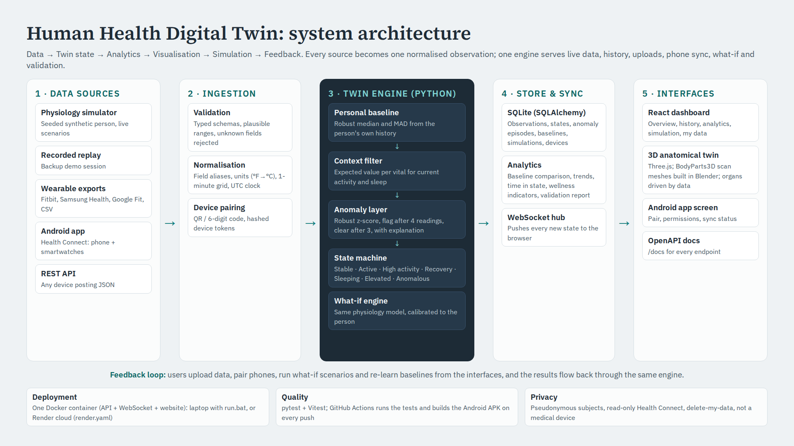

PDF version: [docs/submission/architecture-diagram.pdf](docs/submission/architecture-diagram.pdf). Detailed diagrams (component, sequence, data model, state machine) are in [§6](#6-architecture) and [docs/architecture.md](docs/architecture.md).

### Presentation

[docs/submission/presentation.pdf](docs/submission/presentation.pdf) has 15 slides covering the problem, approach, architecture, 3D twin, explainable anomaly detection, measured results, what-if simulation, real data, the phone connection, engineering, outcomes, limitations and roadmap.

### Public access

All of these are publicly accessible without any sign-in or permission request:
- this repository;
- the documents in [`docs/submission/`](docs/submission);
- the screenshots;
- the demo video (unlisted YouTube: anyone with the link can watch);
- the Android app: [download health-twin.apk](https://github.com/Baranidharan16/Digital-Health-Twin/releases/download/app-latest/health-twin.apk), published by GitHub Actions on every change to the app.

The app can also be built from [`mobile/android`](mobile/android).

**Live website:** [Render URL] (free hosting; the first visit after a quiet period takes about a minute to wake up).

---

## Contents

0. [Submission information](#submission-information)
1. [Project overview](#1-project-overview)
2. [Problem statement](#2-problem-statement)
3. [Why a digital twin](#3-why-a-digital-twin)
4. [Key innovation](#4-key-innovation)
5. [Features](#5-features)
6. [Architecture](#6-architecture)
7. [Digital twin lifecycle](#7-digital-twin-lifecycle)
8. [Technology stack](#8-technology-stack)
9. [Data model](#9-data-model)
10. [API documentation](#10-api-documentation)
11. [Simulation methodology](#11-simulation-methodology)
12. [Anomaly detection methodology](#12-anomaly-detection-methodology)
13. [Installation](#13-installation)
14. [Running locally](#14-running-locally)
15. [Demo instructions](#15-demo-instructions)
16. [Testing](#16-testing)
17. [Screenshots](#17-screenshots)
18. [Limitations](#18-limitations)
19. [Privacy considerations](#19-privacy-considerations)
20. [Future work](#20-future-work)
21. [Hardware integration roadmap](#21-hardware-integration-roadmap)
22. [Team contributions](#22-team-contributions)

---

## 1. Project overview

```
Real-world person ──► readings ──► ingestion ──► DIGITAL TWIN ──► analytics ──► what-if simulation
 (synthetic today;    (HR, SpO₂,   (validate,     (state engine,    (baseline,     (personal model,
  wearable later)      temp, RR,    normalise)     anomaly layer,     trends,        same state
                       steps,                      3D body)           explanations)  engine)
                       activity)
```

The twin represents **Synthetic Subject A** (29 years, pseudonymous). It learns that person's baseline from 7 days of history, then follows a live stream of readings. On every reading it:

1. validates and stores it;
2. works out what each vital *should* be for this person given what they are doing (resting, walking, running, asleep);
3. flags readings that stay outside that expectation, and explains why;
4. moves through explicit, logged states (`STABLE`, `ACTIVE`, `HIGH_ACTIVITY`, `RECOVERY`, `SLEEPING`, `ELEVATED`, `ANOMALOUS`);
5. pushes the new state to the dashboard and to a 3D body. The heart beats at the live heart rate, the lungs breathe at the live breathing rate, the arteries pulse and darken as SpO₂ falls, the diaphragm moves with each breath, muscles glow with measured activity, the figure lies down during sleep, and flagged vitals light up their organ. Organs that no wearable measures are shown but never animated.

## 2. Problem statement

The competition asks for a working Digital Twin proof-of-concept, submitted as a GitHub repository with documentation, to be evaluated by a technical and expert panel.

The health problem we chose: wearables already produce continuous heart rate, SpO₂, temperature, breathing and movement data, but most apps show those numbers in isolation against population thresholds such as "heart rate over 100 bpm". That approach causes two failures:

- **False alarms during normal life.** 150 bpm while running is expected, yet a fixed threshold flags it.
- **Missed personal changes.** A resting heart rate of 85 bpm is "normal" by population standards, but it is a 30% rise for someone whose own resting rate is 66 bpm.

What is missing is a **model of the individual**: one that knows their normal, understands context (activity, sleep), says when and why something changed, and lets them ask "what if?".

## 3. Why a digital twin

A dashboard displays data. A digital twin keeps a **model of a specific real-world entity** synchronised with that entity, and uses the model to explain and simulate. This project implements each part explicitly:

| Digital-twin characteristic | Where it is implemented |
|---|---|
| Digital representation of a real entity | Subject + twin records; 3D body bound to live state (`frontend/src/twin3d`) |
| Structured model / state | `TwinEngine` state: activity context, personal baseline, anomaly trackers, state machine (`digital_twin/`) |
| Synchronisation with incoming data | Every reading → ingestion → engine → DB → WebSocket push (`backend/app/services/twin_service.py`) |
| Analytics on current and historical state | Baseline comparison, rolling features, trends, time-in-state, daily summaries (`queries.py`, `wellness.py`) |
| Detection of abnormal or changing conditions | Context-aware, persistent, explained anomaly flags (`digital_twin/anomaly.py`) |
| Simulation / what-if | Scenario engine calibrated to the twin's baseline (`digital_twin/whatif.py`) |
| Path to real-world data sources | Adapter-based ingestion: simulator, replay, CSV, REST today; wearable/IoT later (`backend/app/ingestion.py`) |

## 4. Key innovation

Four defensible differentiators, each measurable:

1. **Personal, activity-aware expectations instead of population thresholds.** The twin learns the person's baseline with robust statistics (median and MAD), then shifts the expected value of each vital with an activity context filter, so exercise is not mistaken for an anomaly.
2. **Measured detection quality.** The simulator knows exactly when it injected anomalies, so the engine is validated against ground truth on 35 unseen synthetic days:

   | Detector | Episodes caught | False alarms / day |
   |---|---|---|
   | **This twin** (personal + activity-aware) | **77%** (23/30) | **0.0** |
   | Population thresholds (HR>100, SpO₂<94, T≥37.8, RR>20) | 43% (13/30) | 4.6 |

   By episode strength, the twin catches 17% / 82% / 100% of subtle / moderate / strong episodes; the population rule catches 0% / 9% / 92%. Median time to flag is 21 min at 5-minute sampling. The learned resting heart rate is within 0.53 bpm of the simulator's true value. Reproduce with `python -m digital_twin.evaluation`. This validates the engine against its own simulator, not clinically.
3. **Explainable flags and explicit state transitions.** Every flag says what, how much, compared with what, in which context, and for how long, for example *"Heart rate 88 bpm is 24% above the 71 bpm expected for this subject at rest, for 4 consecutive readings (45 s)."* Every state change is stored with its reason.
4. **One model, three uses.** The same physiology equations generate the synthetic data, define the engine's expectations, and drive the what-if simulator. Simulated futures are classified by the same state engine as live data.
5. **Works on real people's data, honestly.** The same engine builds a twin from real wearable exports (Fitbit, Samsung Health, Google Fit, generic CSV). Vitals a device does not measure are shown as *not measured*, never filled in. Organs that no wearable can observe (liver, kidneys and so on) are shown for anatomy but never animated.
6. **Data-bound anatomical twin.** The 3D body comes from BodyParts3D, about 1,050 structures segmented from real scan data and grouped into 19 named structures. The heart beats at the live heart rate, the arteries pulse with it and darken as SpO₂ falls, the lungs and diaphragm move at the breathing rate, muscles glow with activity, the brain glows during sleep, and the body lies down when the device reports sleep.

## 5. Features

- **Live twin** with a guided demo (Normal → Exercise → Recovery → Anomaly) and manual scenario switching (plus Sleep), at 15× time acceleration.
- **Interactive 3D anatomy** (BodyParts3D scan-based meshes, assembled in Blender, rendered with Three.js): skin, skeleton, muscles, organs and vessels as toggleable layers. Click any organ for what it does and which data, if any, drives it. Data-bound animation: heartbeat, arterial pulse and SpO₂ colour, breathing (lungs and diaphragm), muscle activation, sleep posture and brain glow, and status highlights.
- **Real-data twins**: **My data** page to upload exports (Fitbit, Samsung Health, Google Fit, generic CSV) or load the bundled real Fitbit sample. Each upload becomes its own twin (switch in the header), with baseline, states, flags, history, analytics and what-if, and can be deleted completely ("Delete data").
- **Phone connection (Android)**: Kotlin companion app (`mobile/android/`) reading Health Connect; QR/6-digit pairing on the website, per-device tokens (hashed), first sync of 7 days to learn the baseline, then incremental syncs every minute pushed live to the dashboard. Disconnect any phone from the website. APK built by GitHub Actions. `scripts/fake_phone.py` tests the whole path without a phone.
- **Playback**: replay any recorded day minute by minute on the 3D body (Twin page).
- **Explainable anomaly layer** with persistence (4 readings) and hysteresis (3 readings), plus a secondary population reference-range check.
- **Deterministic state engine** with priority rules and debouncing; current state, previous state, transition time and reason are stored.
- **Personal baseline**, re-learnable on demand from the last 7 days, excluding flagged periods.
- **History**: last hour, today, 24 h, 7 days and custom ranges; downsampled charts with baseline lines, anomaly spans and a state timeline.
- **Analytics**: now vs baseline, a validation report, time in state, day-by-day steps, resting HR, sleep and flags, and the resting-HR trend.
- **Wellness indicators** (labelled heuristics): steps vs usual, active minutes, sleep duration and quality, 1-minute heart-rate recovery after exercise, and a recovery index with itemised reasons.
- **What-if simulation**: an exercise session (intensity, duration, optional short prior night) and a sleep-restriction scenario (hours × nights), compared with the person's normal.
- **Ingestion adapters**: REST JSON, CSV upload (field aliases, °F→°C, SpO₂ fraction→%, epoch timestamps), simulator, and replay of a recorded session as the backup demo.
- **OpenAPI docs** at `/docs`, a WebSocket push at `/ws/twin/{id}`, one-click `run.bat` / `run.sh`, Docker, 72 backend tests and 7 frontend tests, GitHub Actions CI.

## 6. Architecture

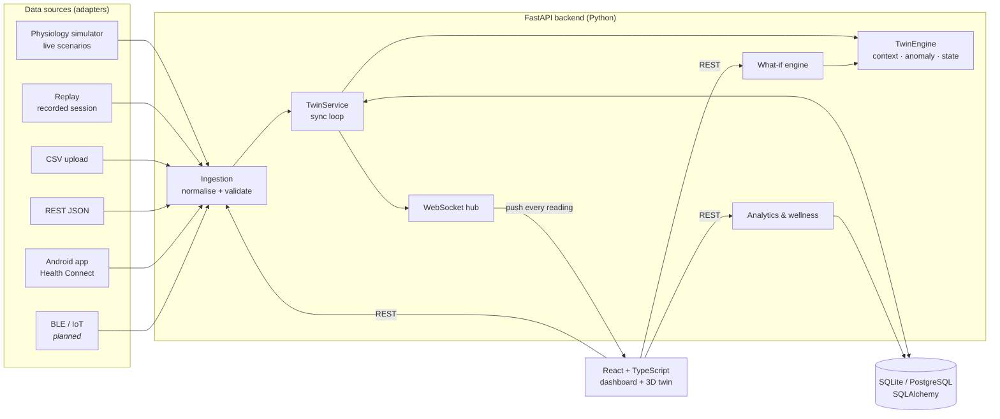
```mermaid
flowchart LR
  subgraph Sources["Data sources (adapters)"]
    SIM[Physiology simulator<br/>live scenarios]
    REP[Replay<br/>recorded session]
    CSV[CSV upload]
    REST[REST JSON]
    PHONE[Android app<br/>Health Connect]
    WEAR[BLE / IoT<br/><i>planned</i>]
  end
  subgraph Backend["FastAPI backend (Python)"]
    ING[Ingestion<br/>normalise + validate]
    SVC[TwinService<br/>sync loop]
    ENG[TwinEngine<br/>context · anomaly · state]
    AN[Analytics &amp; wellness]
    WI[What-if engine]
    HUB[WebSocket hub]
  end
  DB[(SQLite / PostgreSQL<br/>SQLAlchemy)]
  UI[React + TypeScript<br/>dashboard + 3D twin]

  SIM & REP & CSV & REST & PHONE & WEAR --> ING --> SVC --> ENG
  SVC <--> DB
  AN --> DB
  WI --> ENG
  SVC --> HUB -- push every reading --> UI
  UI -- REST --> AN & WI & ING
```

The core engine (`digital_twin/`) is pure Python with no web or database code, so it is unit-tested in isolation and reused by the live pipeline, the history backfill, the what-if engine and the validation harness. Details: [docs/architecture.md](docs/architecture.md).

```
digital-health-twin/
├── backend/app/          FastAPI app: API routes, ingestion adapters, services, ORM models
├── digital_twin/         Core engine: physiology, baseline, anomaly, state machine, what-if, evaluation
├── simulator/            Seeded synthetic data generator and live scenarios
├── frontend/             React + TypeScript + Vite dashboard and 3D twin
├── mobile/android/       Health Twin Android app (Kotlin, Health Connect) → phone sync
├── blender/              Blender script that builds the anatomical twin GLB from BodyParts3D
├── data/                 Recorded demo session (backup demo), real Fitbit sample (sample_real/); runtime DB
├── run.bat, run.sh       One-click start
├── docs/                 Architecture, model, data model, simulation, testing, demo, presentation, audit
├── scripts/              Demo recorder, CSV sample, fake phone (tests the phone sync without a phone)
├── tests/                pytest suite (unit, API, integration, validation)
├── screenshots/
├── Dockerfile, docker-compose.yml, .env.example, LICENSE
```

## 7. Digital twin lifecycle

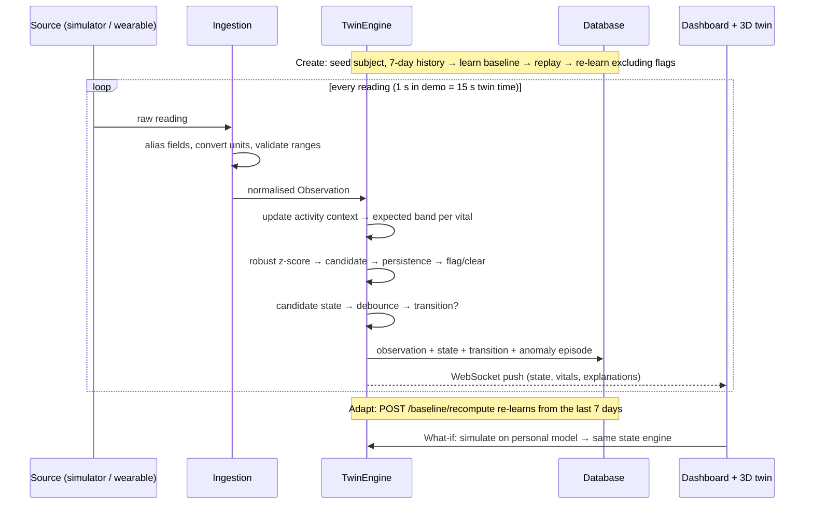
```mermaid
sequenceDiagram
  participant S as Source (simulator / wearable)
  participant I as Ingestion
  participant E as TwinEngine
  participant D as Database
  participant U as Dashboard + 3D twin
  Note over E,D: Create: seed subject, 7-day history → learn baseline → replay → re-learn excluding flags
  loop every reading (1 s in demo = 15 s twin time)
    S->>I: raw reading
    I->>I: alias fields, convert units, validate ranges
    I->>E: normalised Observation
    E->>E: update activity context → expected band per vital
    E->>E: robust z-score → candidate → persistence → flag/clear
    E->>E: candidate state → debounce → transition?
    E->>D: observation + state + transition + anomaly episode
    E-->>U: WebSocket push (state, vitals, explanations)
  end
  Note over E,D: Adapt: POST /baseline/recompute re-learns from the last 7 days
  U->>E: What-if: simulate on personal model → same state engine
```

Restart safety: on startup the engine is rebuilt by replaying the last 2 hours of stored observations, so persistence counters and the current state survive a restart.

## 8. Technology stack

| Layer | Choice | Why |
|---|---|---|
| API | **FastAPI** + Pydantic v2 | Typed validation at the boundary; OpenAPI docs for free; native WebSocket |
| Persistence | **SQLAlchemy 2** + SQLite | Zero-setup local demo; portable types, so PostgreSQL is a URL change |
| Analytics | **NumPy**, **pandas** | Robust statistics, resampling and daily aggregation; no black-box ML needed |
| Frontend | **React 19** + **TypeScript** + **Vite** | Component model, type safety, fast builds |
| 3D | **Three.js** via **React Three Fiber** + drei | Declarative 3D in React; GLB loading; per-frame animation from state |
| Charts | **Recharts** | Time-scale axes, range areas (expected bands), synced tooltips |
| 3D asset | **Blender** (Python script) | Reproducible asset: separate named, pivoted parts the app can animate |
| Tests | **pytest**, **Vitest** | Unit, API, integration and validation tests |
| Packaging | **Docker** (one container) | `docker compose up` serves API, WebSocket and built UI on one port |

We deliberately use no deep learning, message broker or microservices. The detector is a few interpretable rules whose performance is measured, which suits a health prototype better than an opaque model trained on synthetic data.

## 9. Data model

```mermaid
erDiagram
  SUBJECTS ||--o{ TWINS : "represented by"
  TWINS ||--o{ OBSERVATIONS : "synchronised with"
  TWINS ||--o{ BASELINES : "learns (versioned)"
  TWINS ||--o{ STATE_TRANSITIONS : "moves through"
  TWINS ||--o{ ANOMALY_EVENTS : "flags"
  TWINS ||--o{ SIMULATION_RUNS : "simulates"
  SUBJECTS { string id PK; string pseudonym; float age_years; bool is_synthetic; float utc_offset_hours }
  TWINS { string id PK; string subject_id FK; string current_state; string previous_state; datetime state_since; text state_reason; datetime last_observation_at }
  OBSERVATIONS { int id PK; string twin_id FK; datetime timestamp; string source; float heart_rate; float spo2; float temperature; float respiratory_rate; int steps; float activity_intensity; bool is_asleep; string state; string anomalous_metrics }
  BASELINES { int id PK; string twin_id FK; datetime computed_at; bool is_active; json data }
  STATE_TRANSITIONS { int id PK; string twin_id FK; datetime timestamp; string from_state; string to_state; text reason }
  ANOMALY_EVENTS { int id PK; string twin_id FK; string metric; datetime started_at; datetime ended_at; float peak_deviation_pct; text reason }
  SIMULATION_RUNS { int id PK; string twin_id FK; string scenario; json inputs; json summary }
```

**Normalised observation** (the contract every adapter must produce):

| Field | Unit | Valid range | Notes |
|---|---|---|---|
| `timestamp` | ISO-8601 / epoch | must be newer than the last reading | stored as UTC |
| `heart_rate` | bpm | 25–230 | **required** |
| `spo2` | % | 50–100 | optional; fractions (0.97) converted |
| `temperature` | °C | 30–43 | optional; °F converted |
| `respiratory_rate` | br/min | 3–70 | optional |
| `steps` | count since last reading | 0–2000 | |
| `activity_intensity` | 0–1 | 0–1 | accelerometer-derived movement intensity |
| `is_asleep` | bool | | from the device's sleep detection |
| `source` | text | `[A-Za-z0-9_.-]{1,40}` | unknown extra fields are rejected |

The ranges reject physically implausible values (sensor faults). Unusual but possible values are the anomaly layer's job. More detail: [docs/data-model.md](docs/data-model.md).

## 10. API documentation

Interactive OpenAPI docs: **<http://localhost:8000/docs>**.

| Method | Path | Purpose |
|---|---|---|
| GET | `/api/health` | Liveness |
| GET | `/api/twins`, `/api/twin/{id}` | Twin identity (pseudonymous subject) |
| GET | `/api/twin/{id}/state` | Current state, reason, all vital assessments with expected bands |
| GET | `/api/twin/{id}/vitals` | Latest vitals with expected values and status |
| GET | `/api/twin/{id}/history?range=1h\|6h\|24h\|today\|7d\|custom` | Downsampled time series, state segments, anomaly spans |
| GET | `/api/twin/{id}/events` | State transitions and anomaly episodes with explanations |
| GET | `/api/twin/{id}/baseline` | Personal baseline and current comparison |
| POST | `/api/twin/{id}/baseline/recompute` | Re-learn the baseline |
| GET | `/api/twin/{id}/wellness` | Sleep, activity and recovery summaries (heuristic) |
| GET | `/api/twin/{id}/analytics?range=` | Aggregates, time in state, daily table, trend |
| POST | `/api/twin/{id}/observations` | **Ingest one reading** (wearable/REST adapter) |
| POST | `/api/twin/{id}/observations/csv` | Ingest a CSV file (aliases and unit conversion) |
| POST | `/api/twins/import` (multipart: files, display_name, age_years, utc_offset_hours) | **Create a personal twin from real exports** (Fitbit, Samsung Health, Google Fit, generic) |
| POST | `/api/twins/import-sample` | Build a twin from the bundled real Fitbit sample |
| DELETE | `/api/twin/{id}` | Permanently delete a twin and all of its data |
| POST | `/api/devices/pairing`, `/api/devices/claim` | Pair a phone: 6-digit code → device token |
| POST | `/api/devices/sync` (Bearer token) | **Phone uploads Health Connect records** |
| GET / DELETE | `/api/devices`, `/api/devices/{id}` | Connected phones; disconnect |
| POST | `/api/simulation` | What-if: `{"scenario":"exercise",…}` or `{"scenario":"sleep_restriction",…}` |
| GET | `/api/simulation/runs` | Saved simulation runs |
| GET | `/api/scenarios`, `/api/simulator/status` | Live demo scenarios and status |
| POST | `/api/simulator/start` `{scenario, guided, mode: simulator\|replay}` | Start live data |
| POST | `/api/simulator/scenario`, `/api/simulator/stop` | Switch or stop |
| GET | `/api/system/info`, `/api/system/evaluation` | Pipeline, rules, counts; validation report |
| POST | `/api/demo/reset` | Re-seed deterministic demo data |
| WS | `/ws/twin/{id}` | Push: `{"type":"state","data":…}` every reading, `{"type":"live",…}` on control changes |

Example: send a reading as a wearable would.

```bash
curl -X POST http://localhost:8000/api/simulator/stop
curl -X POST http://localhost:8000/api/twin/twin-001/observations -H "Content-Type: application/json" \
  -d '{"timestamp":"2030-01-01T10:00:00Z","heart_rate":72,"spo2":98,"temperature":36.7,"respiratory_rate":14,"steps":12,"activity_intensity":0.1,"source":"my-wearable"}'
curl -X POST http://localhost:8000/api/twin/twin-001/observations/csv -F "file=@scripts/sample_wearable_export.csv"
```

Use a timestamp later than the twin's last reading. The twin clock runs ahead of the wall clock in demo mode.

## 11. Simulation methodology

There are two simulators, both built on the same documented physiology model (`digital_twin/physiology.py`):

- **Max heart rate**: Tanaka population estimate, 208 − 0.7 × age.
- **Target heart rate**: rest + intensity × (max − rest), Karvonen-style across the heart-rate reserve.
- **First-order dynamics**: heart rate rises with τ≈30 s and recovers with τ≈110 s; breathing τ≈25 s, SpO₂ τ≈40 s, temperature τ≈15 min.
- **Exercise effects**: breathing +22 br/min at full intensity, a slight SpO₂ dip, slow temperature rise; steps follow a cadence model.
- **Sleep effects**: heart rate −8 bpm and breathing −1.5 br/min; there is also a circadian temperature rhythm (±0.25 °C) on the subject's local clock.
- **Anomaly pattern**: at rest, heart rate +32%, breathing +6, SpO₂ −3.5 points, temperature +1.3 °C, all scaled by a magnitude of 0–1.
- **Noise**: AR(1) correlated sensor noise; all randomness comes from one seeded generator, so runs are reproducible.

**Data simulator** (`simulator/`): a 7-day daily routine in the subject's local time (sleep, walks, commute, desk time, runs every other day, one unexplained evening episode on day 4) plus live scenarios: Normal, Exercise, Recovery, Anomaly, Sleep, and the guided sequence.

**What-if engine** (`digital_twin/whatif.py`): replaces the simulator's ground truth with the twin's **learned** baseline (resting/sleeping HR, breathing, SpO₂, temperature, estimated max HR), runs noise-free, and passes the trajectory through a fresh `TwinEngine`. That gives a predicted *state sequence*, not just a curve. It compares each run against a reference run after a normal night.

- *Exercise session*: intensity, duration, optional short prior night → peak HR, % of HR reserve, 1-minute HR recovery, minutes to settle, temperature rise, steps, states.
- *Short sleep*: hours × nights → resting HR after each night and recovery of a standard 10-minute brisk walk. The sleep coefficients (+1.2 bpm resting HR per hour of deficit, 50% carry-over per extra night, 6% slower recovery per deficit-hour-night) are **illustrative assumptions**, shown with every result.

All outputs are labelled **"Scenario simulation (model output, not a prediction)"**. More: [docs/simulation.md](docs/simulation.md).

## 12. Anomaly detection methodology

For each vital at each reading (`digital_twin/anomaly.py`):

1. **Expected band.** A personal baseline (median of resting readings) shifted by the activity context. Two filtered intensities, one quick to rise and slow to fall and one the reverse, give a band that widens during transitions, because heart rate legitimately lags movement. Sleep uses the sleeping baseline.
2. **Deviation**: distance outside the band, in units, in %, and as a **robust z-score** (deviation ÷ 1.4826 × MAD of the person's own resting readings, with a floor so a very quiet history does not make the detector hypersensitive).
3. **Candidate**: |z| ≥ 3.5 **and** a practically meaningful change (for example ≥10 bpm and ≥15% for heart rate), in the direction that matters (SpO₂ low only, breathing high only). Alternatively, a value outside general adult reference ranges (SpO₂ < 92%, T ≥ 38 °C, HR > 120 at rest, and similar).
4. **Persistence**: flagged after **4 consecutive** candidate readings; **cleared after 3** consecutive normal readings (hysteresis). One-off glitches never flag.
5. **Explanation** generated from the numbers, for example *"SpO₂ 94.4% is 3% below the 97.7% expected for this subject at rest, for 26 consecutive readings (6 min 15 s)."*
6. **Watch** status (|z| ≥ 2.5–3) shows the `ELEVATED` state before a flag is confirmed.

**State engine** (`digital_twin/state_engine.py`), first match wins: ANOMALOUS → ELEVATED → SLEEPING → HIGH_ACTIVITY (intensity ≥ 0.55) → ACTIVE (≥ 0.20) → RECOVERY (after activity, HR > 10% above resting) → STABLE. A new state needs 2 confirming readings; ANOMALOUS is immediate because persistence is already applied.

Validation results are in [Key innovation](#4-key-innovation); method details are in [docs/digital-twin-model.md](docs/digital-twin-model.md).

## 13. Installation

**Option 0: one click.** Windows: double-click `run.bat`. macOS/Linux: `./run.sh`. It creates `.venv`, installs packages, builds the website if needed, starts the server and opens the browser.

> **Windows tip:** if Explorer extracted the zip into `digital-health-twin\digital-health-twin`, open the inner folder (the one containing `README.md`) before running anything.

**Online (free):** deploy to Render from GitHub in a few clicks with the included `render.yaml`; the phone app then works from any network. See [docs/deploy.md](docs/deploy.md).

**Option A: Docker** (needs Docker Desktop)

```bash
git clone <this-repo> && cd digital-health-twin
docker compose up --build        # first build ~2–4 min
# open http://localhost:8000
```

**Option B: local** (Python 3.11+, Node 20+)

```bash
python -m venv .venv
source .venv/bin/activate        # Windows: .venv\Scripts\activate
pip install -r requirements-dev.txt

cd frontend && npm ci && npm run build && cd ..
```

## 14. Running locally

```bash
# from the repository root, with the virtualenv active
python -m uvicorn backend.app.main:app --host 0.0.0.0 --port 8000
# open http://localhost:8000   (the backend serves the built frontend)
```

`--host 0.0.0.0` lets a phone on the same Wi-Fi reach the server (needed only for the phone app; use `--port 8000` alone to keep it local). Phone set-up: [docs/mobile.md](docs/mobile.md).

On first start the backend creates `data/twin_v2.db`, seeds 7 days of synthetic history (about 1 s), learns the baseline and starts the live stream. To develop the UI with hot reload, run `cd frontend && npm run dev` and open <http://localhost:5173>; it proxies to the backend.

Configuration uses environment variables with the `DHT_` prefix. See [.env.example](.env.example). No secrets are needed.

## 15. Demo instructions

1. Open <http://localhost:8000>. The **Overview** shows the five-step loop (readings arrive → twin updates → state changes → analytics explain → simulate), the current state with its reason, the 3D twin, and vitals against this person's expected range.
2. Click **Run guided demo** (about 70 s): Normal → Exercise (High activity, heart rate ~160 bpm accepted as expected) → Recovery (heart rate settles, 1-minute HR recovery is reported) → Anomaly (heart rate, breathing, SpO₂ and temperature drift at rest, flagged with reasons, and the heart and lungs light up).
3. Open **Simulation**, choose *Exercise session* with *After a short night*, and run it to compare with a normal night.
4. Open **Analytics** for the validation table (twin vs population thresholds).
5. **Real data:** **My data → Load real Fitbit sample → Open this twin**. The same engine now shows a real person: resting heart rate 65, sleeping 59, about 7,400 steps a day, real states and flags. SpO₂, temperature and breathing are greyed out because that device never measured them. On **Twin**, press **Load day → Play** to replay a real day on the anatomy.

The full 3–5 minute script with talking points, and the **backup demo** (System → *Play recorded session*, or `POST /api/simulator/start {"mode":"replay"}`), are in [docs/demo.md](docs/demo.md). A slide outline is in [docs/presentation.md](docs/presentation.md).

## 16. Testing

```bash
pytest                          # 72 backend tests, ~25 s
cd frontend && npm test         # 7 frontend tests (data → 3D anatomy mapping)
python -m digital_twin.evaluation   # validation report (JSON)
```

| Area | File |
|---|---|
| Data validation and normalisation | `tests/test_ingestion.py` |
| Baseline (accuracy, outlier robustness, floors) | `tests/test_baseline.py` |
| Anomaly detection (persistence, hysteresis, context, explanations) | `tests/test_anomaly.py` |
| State engine and transitions | `tests/test_state_engine.py` |
| Simulator (seed reproducibility, correlations) | `tests/test_simulator.py` |
| What-if engine | `tests/test_whatif.py` |
| REST, CSV, WebSocket, live control, replay | `tests/test_api.py` |
| Real-data import (Fitbit, Samsung, Google Fit, CSV) | `tests/test_import.py` |
| Phone connection: pairing, tokens, first and incremental sync, revoke | `tests/test_devices.py` |
| **Integration**: simulated stream → REST ingestion → twin → state → API; validation guard | `tests/test_integration.py` |

All tests pass from a clean virtualenv (`pip install -r requirements-dev.txt && pytest`). See [docs/testing.md](docs/testing.md).

## 17. Screenshots

| | |
|---|---|
| 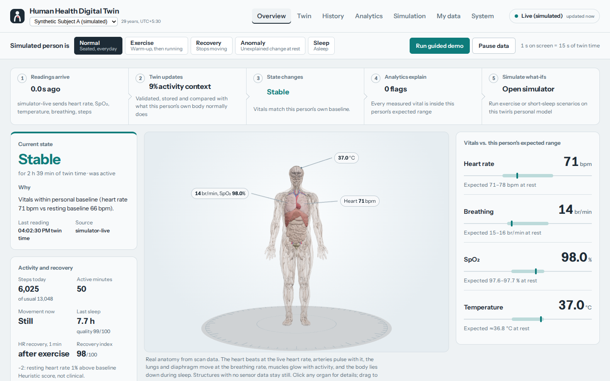 Live demo twin, stable | 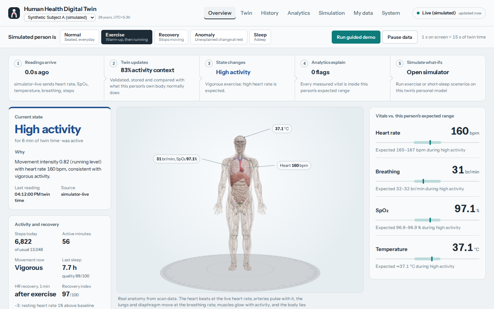 Exercise: HR 160 is expected, not flagged |
|  Anomaly flagged with reasons | 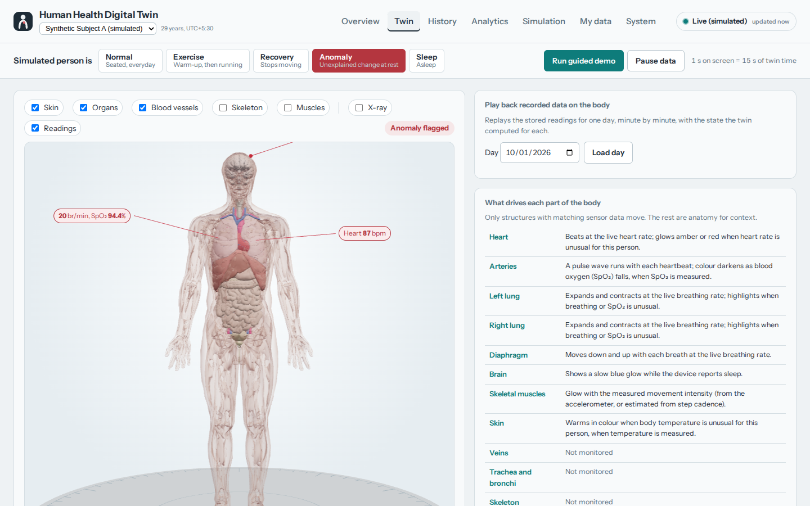 Scan-based anatomy with data-driven organs |
| 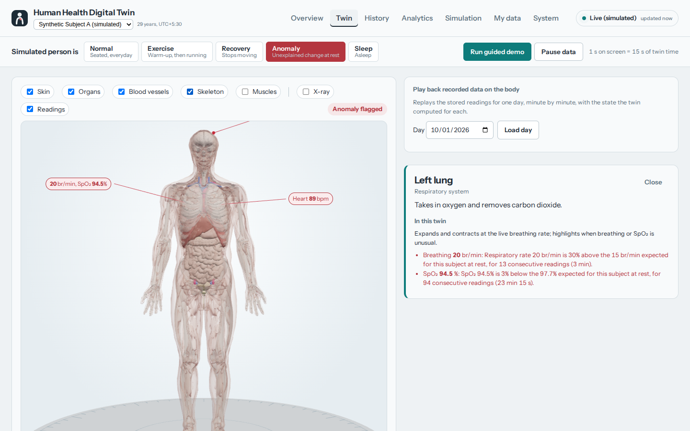 Click an organ: role and live data | 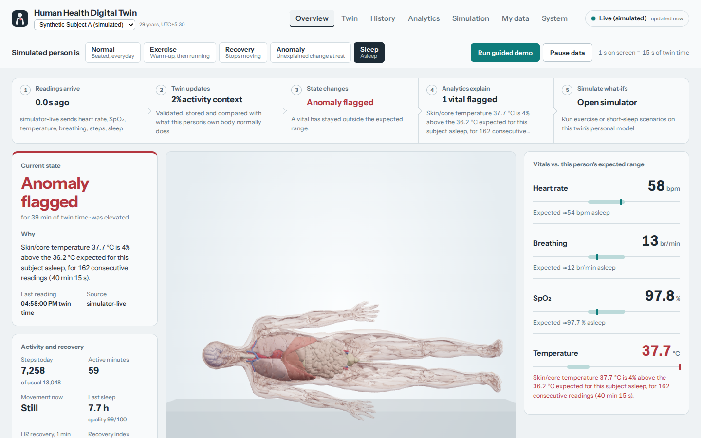 Sleep posture and sleeping baseline |
| 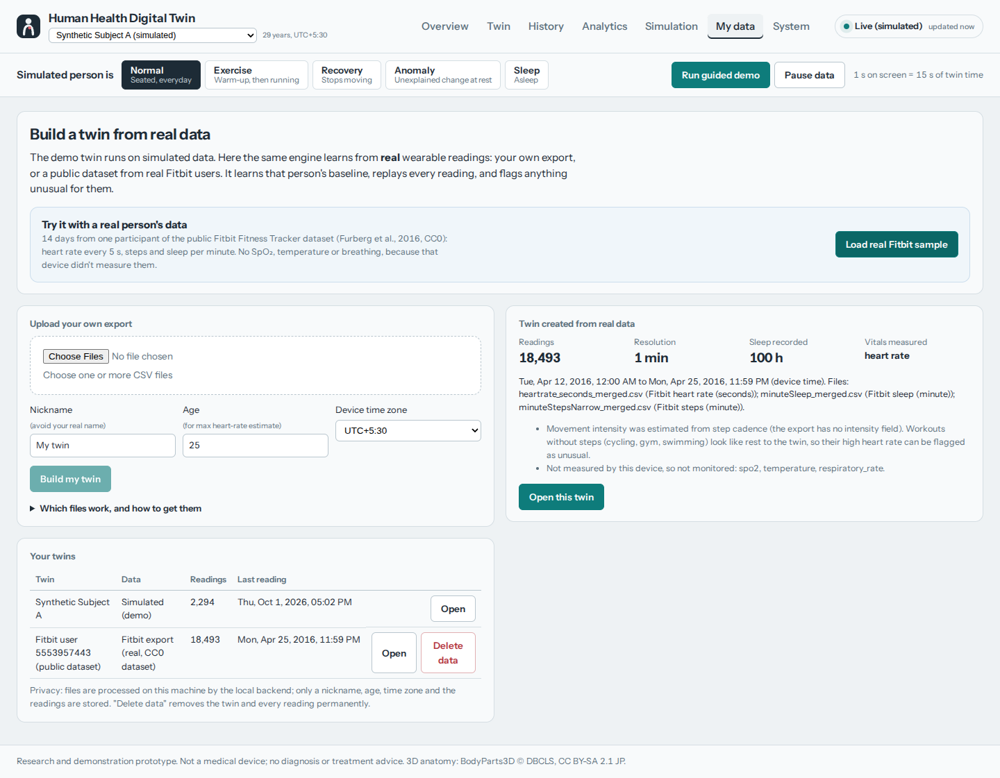 Building a twin from a real Fitbit export | 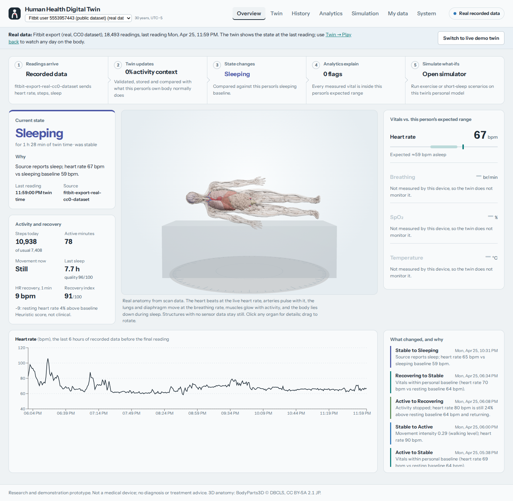 Real person's twin; unmeasured vitals greyed out |
| 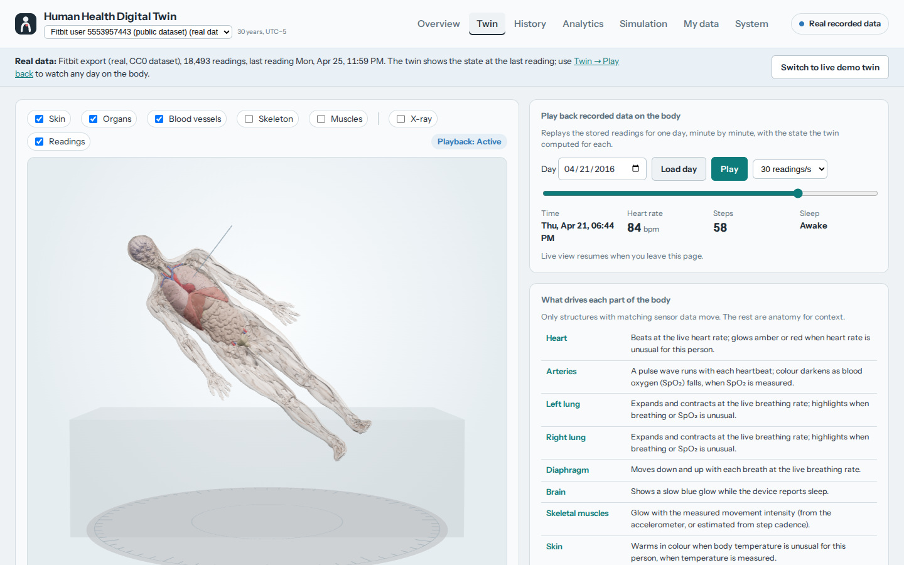 Replaying a real day on the anatomy | 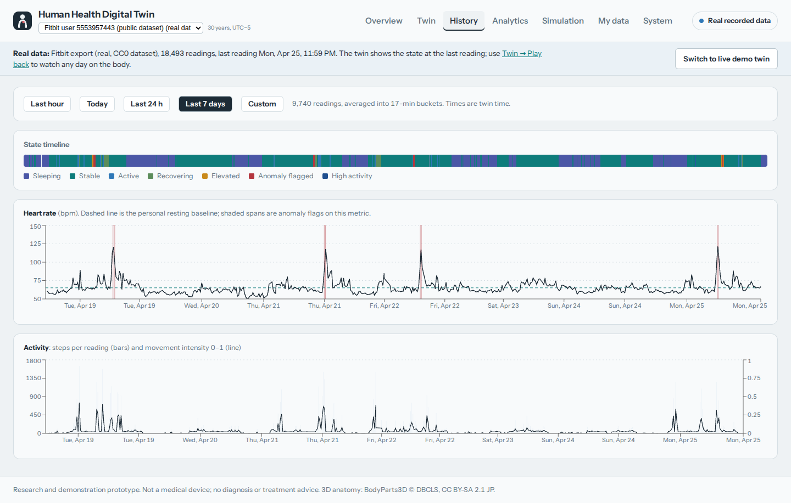 7 days of real data with states and flags |
| 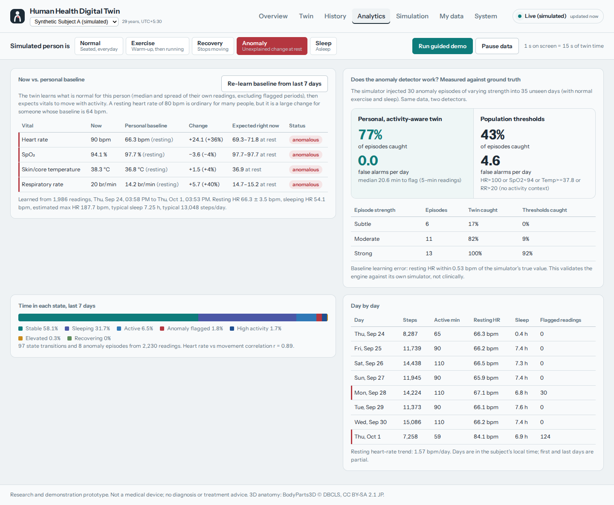 Baseline and validation | 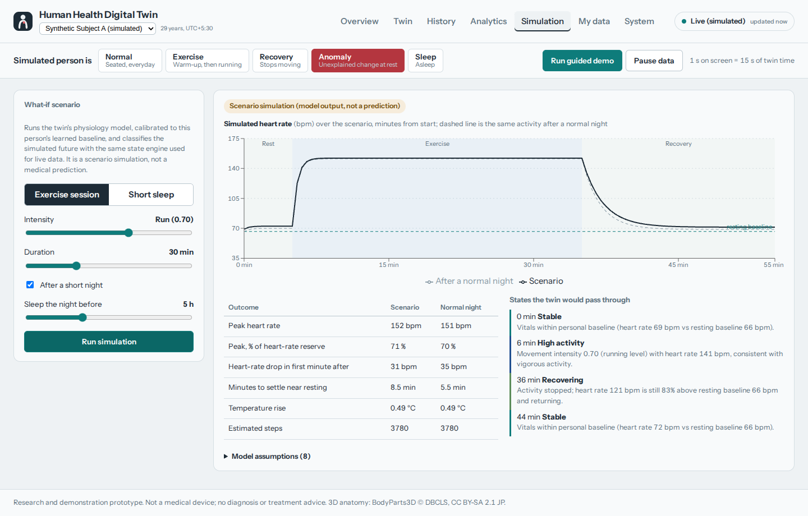 What-if simulation |
| 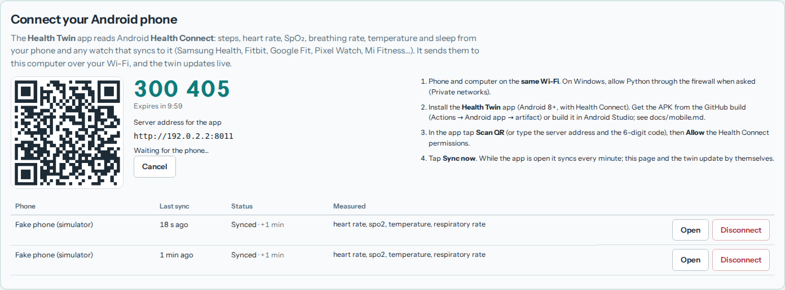 Pairing an Android phone (QR + code) | 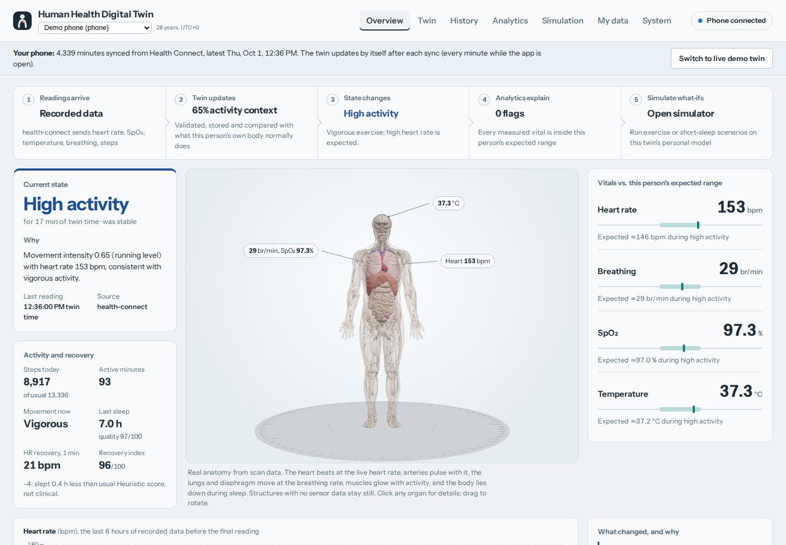 Twin fed by phone sync (here the fake-phone script, running) |

## 18. Limitations

- **Validation is synthetic.** Detection accuracy is measured on simulated data with known ground truth. The real Fitbit sample shows the engine running on real data, but there are no labels on real data, so real-world accuracy is not claimed.
- **Activity from steps.** Real exports rarely include movement intensity, so it is estimated from step cadence. Workouts without steps (cycling, gym, swimming) look like rest, and their high heart rate can be flagged. The import result says so.
- **Wearables see only part of the body.** Heart rate, SpO₂, temperature, breathing, movement and sleep drive the anatomy. Liver, kidneys, digestive organs, veins and skeleton are shown for context and are never animated.
- **One reference body.** The anatomy is a single adult male model; it is not scaled to the user.
- **Simplified physiology.** First-order dynamics and a linear heart-rate/intensity relation; no cardiac drift, hydration, medication, stress, illness types or individual time constants. The maximum heart rate is a population estimate.
- **Sleep-scenario coefficients are illustrative**, not fitted to literature or data.
- **Heuristic wellness scores** (sleep quality, recovery index) are transparent but unvalidated.
- **Subtle changes are hard.** Only 17% of the weakest injected episodes are caught. This is the price of zero false alarms per day; the thresholds are a tunable trade-off.
- **Detection latency** of about 20 minutes at 5-minute sampling (4 readings), which is faster with denser data.
- **Demo time is accelerated** 15×, so the twin clock runs ahead of the wall clock during a demo.
- **Phone app**: Android only (iPhone/HealthKit needs a separate app), syncs only while open, watch data may reach the phone 15–30 min late, plain HTTP on the local network. The APK is built in GitHub Actions; it could not be compiled in the development sandbox.
- **Single-node prototype**: one process, SQLite, no user accounts (phones use per-device tokens), and one demo twin seeded.

## 19. Privacy considerations

- **Synthetic by default.** The demo twin is synthetic. The bundled real sample is from a public, anonymised, CC0 research dataset (participant ID only).
- **Your uploads stay on your machine.** Files are processed by the local backend; only a nickname, age, time zone and readings are stored. **Delete data** permanently removes a twin and every reading (right to erasure). The live simulator refuses to drive a real-data twin.
- **Phone data stays local.** The app is read-only on Health Connect and sends data only to the computer it paired with. Pairing uses a single-use 10-minute code, then a random token of which the server stores only the hash. Disconnect revokes it immediately.
- **Data minimisation.** The subject has a pseudonym, an age and a time zone only: no name, contact details, location or device identifiers. The ingestion schema rejects unknown fields, so stray PII in a payload is refused, not stored.
- **Validation at the boundary.** Typed Pydantic schemas, plausibility ranges, a strict `source` pattern, a CSV size limit (5 MB), and parameterised ORM queries only.
- **Configuration through environment variables**; no secrets are needed and `.env` is git-ignored.
- **Not a medical device**: the UI, API description and every simulation result carry this.
- For real data, a deployment would add authentication, TLS, encryption at rest, consent records and retention limits, aligned with India's DPDP Act 2023 or GDPR as applicable.

## 20. Future work

- Real-data pilot with consenting users; calibrate time constants and spreads per person (online estimation).
- Learn each person's heart-rate/activity curve (binned or regression) instead of the Karvonen line.
- Multi-signal anomaly scoring (combined evidence across vitals) and trend detectors (CUSUM) for slow drifts.
- HRV-based recovery indicators when beat-to-beat data is available.
- Multiple twins, authentication and roles; PostgreSQL/TimescaleDB for long histories.
- More scenarios: hydration and heat, altitude, training plans over weeks.

## 21. Hardware integration roadmap

The engine only sees the normalised observation, so hardware work is limited to new adapters:

| Phase | Source | Adapter work |
|---|---|---|
| 1 (done) | CSV exports (e.g. Google Fit or Apple Health converted to CSV) | `POST /observations/csv` with aliases and unit conversion |
| 2 (done) | Android phone and watches via **Health Connect** (Health Twin app) | `POST /api/devices/sync`, paired by QR code |
| 2b | iPhone (HealthKit) app; background sync; vendor cloud APIs (Garmin) | Same sync endpoint |
| 3 | BLE devices (standard Heart Rate Service 0x180D, Pulse Oximeter 0x1822, Health Thermometer 0x1809) | Phone/edge gateway reading GATT characteristics → REST or MQTT |
| 4 | Low-cost IoT prototype (ESP32 + MAX30102 SpO₂/HR + MLX90614 temperature + MPU6050 accelerometer) | Firmware posts JSON every 5–15 s; intensity derived from accelerometer magnitude |

Each phase reuses the existing validation, engine, storage, UI and tests unchanged.

## 22. Team contributions

Team and college details are in [Submission information](#team-details).

| Member | Contributions |
|---|---|
| [Team lead name] | [What they built] |
| [Member 2 name] | [What they built] |
| [Member 3 name] | [What they built] |

AI assistance: parts of this project were developed with an AI assistant (Claude). All code was reviewed, run and tested by the team.

---

License: MIT (see [LICENSE](LICENSE)); third-party licences are listed in [Open-source licence details](#open-source-licence-details). This software is a research and demonstration prototype, not a medical device, and must not be used for diagnosis or treatment.

### Credits and data licences

- **3D anatomy**: BodyParts3D, © The Database Center for Life Science, licensed under CC Attribution-Share Alike 2.1 Japan. Mitsuhashi N. et al., *BodyParts3D: 3D structure database for anatomical concepts*, Nucleic Acids Res. 2009;37:D782–5, doi:10.1093/nar/gkn613. STL mirror: github.com/Kevin-Mattheus-Moerman/BodyParts3D. The derived model `frontend/public/models/anatomy_twin.glb` is shared under the same CC BY-SA 2.1 JP licence.
- **Real wearable sample**: Furberg R., Brinton J., Keating M., Ortiz A. (2016). *Crowd-sourced Fitbit datasets 03.12.2016–05.12.2016* [Data set], Zenodo, doi:10.5281/zenodo.53894, CC0 1.0. The 14-day excerpt for participant 5553957443 is in `data/sample_real/`.

