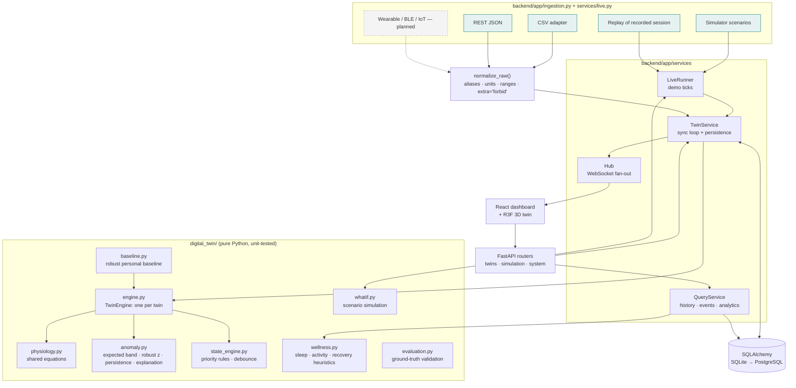
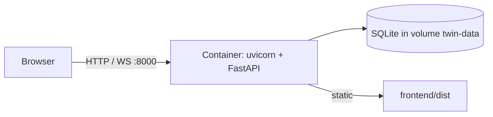

# Architecture

## Goals that shaped it

1. **The twin must be a model, not a view.** All twin logic lives in a framework-free package (`digital_twin/`), which the web layer only orchestrates.
2. **Any data source, one contract.** Every source is reduced to the same normalised `Observation` before it reaches the engine.
3. **Reproducible and runnable by a judge in one command.** One container, SQLite, seeded randomness.
4. **Every component earns its place.** No broker, no microservices, no ML model that cannot be explained.

## Components

| Component | Responsibility | Why it exists |
|---|---|---|
| `physiology.py` | Target heart and breathing rates for an intensity, first-order dynamics, cadence | One set of equations for the simulator, the engine's expectations and the what-if engine keeps the system consistent |
| `baseline.py` | Median and MAD of the person's resting and sleeping readings; typical steps and sleep | Personal "normal"; robust to outliers and flagged days |
| `anomaly.py` | Expected band per vital, robust z, candidate, persistence and hysteresis, explanation | Interpretable, measured detection |
| `state_engine.py` | Candidate state by priority; debounced transitions | Deterministic, testable evolving state |
| `engine.py` | Holds per-twin context filters, trackers, state machine and rolling window | The stateful core of the twin |
| `TwinService` | Runs the sync cycle per observation; persists observation, state, transitions and episodes; notifies listeners; rebuilds the engine on restart | Keeps the database the system of record without coupling the engine to SQL |
| `QueryService` | History downsampling, events, baseline comparison, analytics, wellness | Read side, anchored on the twin clock |
| `LiveRunner` | Async loop emitting one reading per tick from a scenario or the replay file | Demo mode; uses the same ingestion path as real data |
| `Hub` | Per-client bounded queues; thread-safe publish | Pushes each update to the UI within one tick; a slow client never blocks ingestion |

## Synchronisation cycle (per reading)

1. **Adapter** produces a raw dict, which `normalize_raw` turns into a validated `ObservationIn`. A wrong shape returns `422`, and an out-of-order timestamp returns `409`.
2. **`TwinEngine.ingest`**:
   - update the activity-context filters (effective, lagging and slow intensity);
   - assess four vitals against expected bands (`MetricAssessment` with value, band, z, status and reason);
   - choose a candidate state and apply a debounced transition;
   - update rolling 5-minute and 10-minute features and the 1-minute heart-rate recovery.
3. **Persist** the observation together with the state and flagged metrics; insert a state transition and open or close anomaly episodes; update the twin row.
4. **Publish** the state payload over the WebSocket. The UI updates the panels, charts and 3D body.

Ingestion is serialised per process by a re-entrant lock, so the live loop, REST and CSV ingestion cannot interleave on one twin.

## Time

- Stored as **naive UTC**; the API serialises with a `Z`.
- The **twin clock** is the timestamp of the latest observation. History ranges ("last hour", "today") are anchored on it, so they stay correct when demo time runs 15× faster than the wall clock.
- **Data freshness** in the UI is measured from when the browser last received an update.
- The subject's **UTC offset** defines "today", daily totals and the simulated daily routine.

## Deployment

One multi-stage Dockerfile builds the frontend with Node, then runs FastAPI on `python:3.11-slim` as a non-root user with a healthcheck. FastAPI serves the built single-page app, so there is no CORS and a single port. To move to PostgreSQL, set `DHT_DATABASE_URL`; the models use portable column types only.

## Scaling path (not needed for the prototype)

- One `TwinEngine` per twin in memory is cheap (about kilobytes). Shard twins across workers by `twin_id` when needed.
- Replace the in-process hub with Redis pub/sub when running several API workers.
- Use TimescaleDB hypertables for observations once histories reach months.
