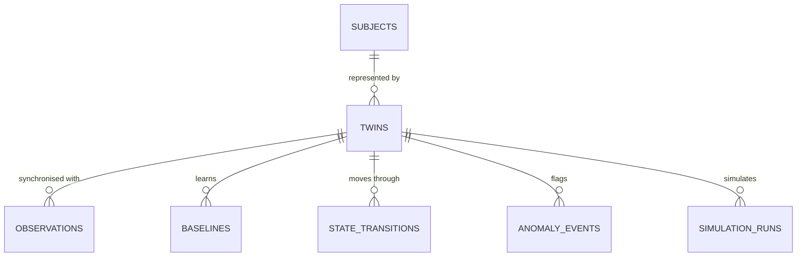

# Data model

## Entities



| Table | Purpose | Key columns |
|---|---|---|
| `subjects` | The person a twin represents. **No PII.** | `id`, `pseudonym`, `age_years`, `is_synthetic`, `utc_offset_hours`, `simulation_profile` (JSON, synthetic subjects only) |
| `twins` | The digital twin and its **current** state | `current_state`, `previous_state`, `state_since`, `state_reason`, `last_observation_at`, `last_received_at`, `last_hr_recovery_bpm`, `observation_count` |
| `observations` | Every normalised reading **plus the twin state after it** | vitals, `steps`, `activity_intensity`, `is_asleep`, `source`, `received_at`, `state`, `anomalous_metrics`, `watch_metrics`; unique (`twin_id`, `timestamp`) |
| `baselines` | Versioned personal baselines; one `is_active` per twin | `computed_at`, `data` (JSON of `Baseline`) |
| `state_transitions` | Audit trail of state changes | `timestamp`, `from_state`, `to_state`, `reason` |
| `anomaly_events` | One row per anomaly **episode** per metric | `metric`, `started_at`, `ended_at` (null while active), `value`, `expected`, `peak_deviation_pct`, `reason` |
| `simulation_runs` | Saved what-if runs | `scenario`, `inputs`, `summary` |

Design notes:

- Storing the state on each observation makes the state timeline and "what was the twin doing at time t" a single indexed query, with no replay needed.
- Anomaly **episodes** (start/end) instead of per-reading flags keep the event feed readable and let the history chart draw spans.
- Baselines are **versioned**, not overwritten, so you can see how the personal model evolved.
- All types are portable (String, Float, Integer, Boolean, DateTime, JSON, Text), so SQLite and PostgreSQL both work.

## Normalised observation (ingestion contract)

See the README's [data model section](../README.md#9-data-model) for field ranges. Accepted input variations (`backend/app/ingestion.py`):

| Field | Accepted names | Conversions |
|---|---|---|
| timestamp | `timestamp`, `time`, `ts`, `datetime`, `recorded_at` | ISO-8601 (with or without `Z`/offset), epoch seconds or milliseconds → naive UTC |
| heart_rate | `heart_rate`, `hr`, `bpm`, `pulse` | |
| spo2 | `spo2`, `oxygen_saturation`, `sp_o2`, `o2sat` | 0–1 fraction → % |
| temperature | `temperature`, `temp`, `temperature_c`, `skin_temp`; `temperature_f`, `temp_f`; or `temperature_unit: "F"` | °F → °C |
| respiratory_rate | `respiratory_rate`, `rr`, `resp_rate`, `breathing_rate` | |
| steps | `steps`, `step_count` | float → int |
| activity_intensity | `activity_intensity`, `intensity`, `activity` | |
| is_asleep | `is_asleep`, `asleep`, `sleep` | `true/1/yes/y/asleep` → true |

Rejections and their HTTP codes: a missing timestamp, an implausible range or an unknown field returns **422**. A timestamp not newer than the twin's last reading returns **409**. A CSV larger than 5 MB returns **413**. CSV rows are validated one by one, and the response lists the line numbers that failed.

## Example state payload (WebSocket and `GET /state`)

```json
{
  "twin_id": "twin-001",
  "state": "ANOMALOUS",
  "previous_state": "ELEVATED",
  "state_since": "2026-10-01T01:52:15Z",
  "state_reason": "Heart rate 88 bpm is 24% above the 71 bpm expected for this subject at rest, for 4 consecutive readings (45 s). ...",
  "twin_time": "2026-10-01T01:55:00Z",
  "data_age_seconds": 0.4,
  "observation": {"heart_rate": 88.4, "spo2": 94.4, "temperature": 37.6, "respiratory_rate": 21.0,
                  "steps": 0, "activity_intensity": 0.03, "is_asleep": false, "source": "simulator-live"},
  "assessments": {
    "heart_rate": {"value": 88.4, "expected": 71.1, "expected_low": 70.2, "expected_high": 71.1,
                   "deviation": 17.3, "deviation_pct": 24.3, "robust_z": 4.7, "status": "anomalous",
                   "consecutive": 4, "context": "at rest", "reason": "Heart rate 88 bpm is 24% above ..."}
  },
  "effective_intensity": 0.04,
  "activity_level": "Still",
  "rolling": {"heart_rate_5min": 86.9, "steps_10min": 0},
  "last_hr_recovery_bpm": 40.0
}
```
