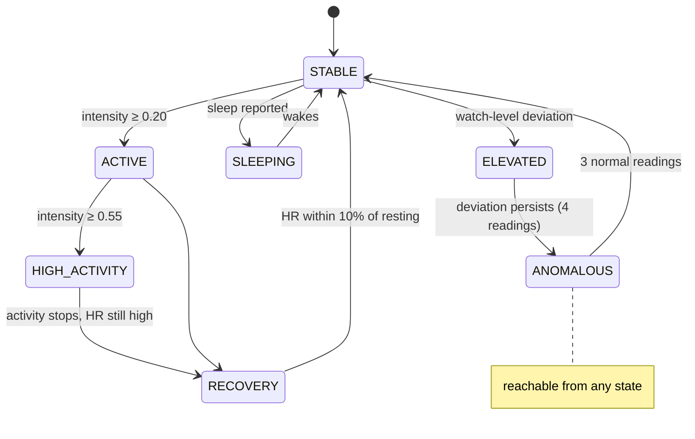

# The digital twin model

This document defines exactly what the twin knows, how it updates, and what each state and flag means. Everything here is implemented in `digital_twin/` and covered by tests.

## 1. Twin state

| Part | Content | Source |
|---|---|---|
| Identity | `twin_id`, `subject_id`, pseudonym, age, UTC offset, `created_at`, `updated_at` | `twins`, `subjects` tables |
| Physiological state | heart rate, SpO₂, temperature, respiratory rate (latest + 5-min rolling means) | latest observation, `engine._rolling` |
| Activity state | movement intensity (0–1), activity level label, effective activity context, steps (latest, 10-min, today), active minutes | observation, engine filters, `wellness.activity_today` |
| Recovery / wellness | last completed sleep (duration, restlessness, HR dip, quality score), recent resting HR, 1-min heart-rate recovery, recovery index | `wellness.py` |
| Personal baseline | resting/sleeping HR and breathing, SpO₂, awake/asleep temperature, robust spreads, estimated max HR, typical steps and sleep | `baseline.py`, `baselines` table (versioned) |
| Derived features | expected band per vital, deviation (units and %), robust z, consecutive count, context | `anomaly.py` |
| Discrete state | current, previous, since, reason; full transition history | `state_engine.py`, `state_transitions` |
| Anomaly episodes | metric, start, end, peak deviation, explanation | `anomaly_events` |

## 2. Personal baseline

**Why personal?** Resting heart rate varies widely between healthy adults. A population rule cannot tell that 80 bpm at rest is a large change for someone whose own normal is 64 bpm, while the same rule raises false alarms every time that person exercises. The twin learns the individual.

**How** (`compute_baseline`):

- Uses the last 7 days, **excluding readings the twin had flagged as anomalous**. On first creation it learns from raw history, replays the history, then re-learns excluding flags.
- **Resting** readings are awake readings with intensity below 0.10. Sleeping readings come from the device's sleep flag.
- **Centre** is the median. **Spread** is 1.4826 × MAD, which is comparable to a standard deviation but robust to outliers. The test suite checks that corrupting 5% of resting readings with 180 bpm moves the baseline by less than 1.5 bpm.
- **Spread floors**: HR 3.5 bpm, RR 1.2 br/min, SpO₂ 0.6 points, temperature 0.12 °C. These stop a very quiet history from producing huge z-scores for trivial changes.
- **Typical steps** is the median of complete local days. **Typical sleep** is the median length of main sleep episodes (≥ 3 h).
- **Estimated max HR** uses the Tanaka formula, 208 − 0.7 × age. This is a population estimate and is labelled as such.

## 3. Activity context

Heart rate does not follow movement instantly. If the expected value followed instantaneous intensity, every start and stop of exercise would look abnormal. The engine therefore keeps three filtered intensities:

| Filter | Rises | Falls | Used for |
|---|---|---|---|
| effective | τ 20 s | τ 180 s | upper edge of the expected band (slow to forget exertion, covers recovery) |
| lagging | τ 60 s | τ 15 s | lower edge (slow to believe exertion, covers the rise at the start) |
| slow | τ 900 s | τ 900 s | temperature (thermal inertia) |

While activity is steady both edges meet and the band collapses to one value. During transitions it widens. The spread also widens with intensity (× (1 + 2 × intensity)) because variability grows with exertion.

## 4. Anomaly rules

| Vital | Direction | Flag at robust z ≥ | Watch at z ≥ | And change ≥ | Reference-range check |
|---|---|---|---|---|---|
| Heart rate | both | 3.5 | 3.0 | 10 bpm and 15% | > 120 at rest, < 40 |
| Respiratory rate | high | 3.5 | 2.5 | 4 br/min and 20% | > 25 at rest |
| SpO₂ | low | 3.5 | 2.5 | 2 points and 2% | < 92% |
| Temperature | both | 3.5 | 3.0 | 0.5 °C and 1.2% | ≥ 38.0 or ≤ 35.0 °C |

- A **candidate** must be statistically unusual **and** practically meaningful, or outside a general adult reference range.
- A candidate becomes **anomalous** after **4 consecutive** candidate readings. A flag **clears** after **3 consecutive** normal readings (watch readings do not count towards clearing).
- **Explanations** are built from the numbers: value, % and direction, expected value, context, consecutive readings and elapsed time, plus any reference-range note.

### Body-region mapping (3D twin)

| Region | Driven by |
|---|---|
| Heart | `heart_rate` status; pulse frequency = live HR |
| Lungs | worst of `respiratory_rate` and `spo2` status; breathing frequency = live RR |
| Head | `temperature` status |
| Limbs | `activity_intensity` (gait amplitude and speed) |
| Posture | `is_asleep` (lying down) |
| Body tint | twin state colour |

The mapping is a pure function (`frontend/src/lib/twinVisuals.ts`) with unit tests.

## 5. State engine

Candidate state, first matching rule wins:

| Priority | State | Rule | Meaning (not a diagnosis) |
|---|---|---|---|
| 1 | `ANOMALOUS` | any vital has a confirmed flag | a vital stayed outside this person's expected range |
| 2 | `ELEVATED` | any vital at watch level | something is unusual, not yet persistent |
| 3 | `SLEEPING` | source reports sleep | compared with the sleeping baseline |
| 4 | `HIGH_ACTIVITY` | intensity ≥ 0.55 | vigorous activity; high HR expected |
| 5 | `ACTIVE` | intensity ≥ 0.20 | walking-level movement |
| 6 | `RECOVERY` | previous state active or recovering, and HR > 10% above resting baseline | settling after activity |
| 7 | `STABLE` | otherwise | close to personal baseline |

**Debounce**: a new candidate must repeat for 2 readings before a transition, except `ANOMALOUS`, which already includes persistence. Each transition stores `from`, `to`, timestamp and reason. The engine is deterministic: the same readings always produce the same states (tested).

## 6. Wellness heuristics (labelled as heuristics in the UI)

- **Sleep quality (0–100)**: 60 points for duration vs personal norm, 25 for calm (1 − restless fraction), 15 for heart-rate dip below resting (full marks at 10%).
- **Recovery index (0–100)**: starts at 100; −10 per hour of sleep below norm (max −40), −2 per % resting HR above baseline (max −30), −20 while a flag is active. The UI lists each penalty.
- **Heart-rate recovery, 1 min**: HR at the last active reading minus HR 60 s later. This is a common fitness indicator, reported here as a trend feature only.

## 7. Validation

`digital_twin/evaluation.py` trains a baseline on a clean synthetic week, then runs the engine on an unseen week with 6 injected episodes (40–120 min, magnitude 0.3–1.0, awake or asleep) for each of 5 seeds:

| Metric | Twin | Population thresholds |
|---|---|---|
| Episodes caught | 77% (23/30) | 43% (13/30) |
| Subtle / moderate / strong | 17% / 82% / 100% | 0% / 9% / 92% |
| False alarms per day | 0.0 | 4.6 |
| Median time to flag | 20.6 min (5-min sampling) | — |
| Resting HR learning error | ≤ 0.53 bpm | — |

`tests/test_integration.py::test_engine_validation_metrics` guards these numbers. This is a validation of the engine against its own simulator, not a clinical validation.
