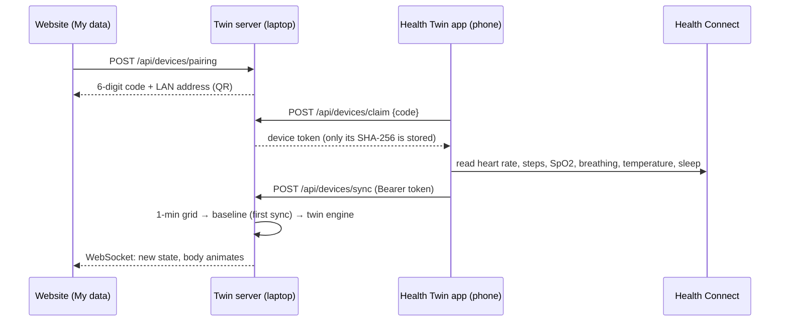

# Phone connection: Health Twin Android app

The **Health Twin** app (`mobile/android/`) connects an Android phone to the twin on your computer. It reads **Health Connect**, Android's on-device health store. Most watches and fitness apps write into it: Samsung Health (Galaxy Watch), Fitbit, Google Fit, Pixel Watch, Mi Fitness, Withings, Oura and others. One app therefore covers the phone *and* most smartwatches without integrating each vendor's API.



## What is read and sent

| Health Connect record | Sent as | Notes |
|---|---|---|
| `HeartRateRecord` | `heart_rate[] {t, bpm}` | **Required.** Averaged per minute on the phone |
| `StepsRecord` | `steps[] {start, end, count}` | Spread over the minutes it covers; drives the activity estimate |
| `OxygenSaturationRecord` | `spo2[] {t, pct}` | Optional, per-minute mean |
| `RespiratoryRateRecord` | `respiratory_rate[] {t, rate}` | Optional |
| `BodyTemperatureRecord` | `temperature[] {t, celsius}` | Optional |
| `SleepSessionRecord` | `sleep[] {start, end}` | Puts the twin in its sleeping state |

The first sync sends the **last 7 days**, which the twin needs to learn a personal baseline (at least about an hour of resting heart rate). Later syncs send from 2 hours before the previous sync; the server keeps only readings newer than the twin's last one. While the app is on screen it syncs **every minute**. Types the user does not allow are skipped, and vitals that were never measured are shown as "not measured" on the website.

If there is too little history yet, the server answers `waiting_for_more_data` and the app keeps the 7-day window for the next try.

## Set-up (about 5 minutes)

1. **Start the server so phones can reach it.** `run.bat` / `run.sh` now listen on the network (`--host 0.0.0.0`). Manual start: `python -m uvicorn backend.app.main:app --host 0.0.0.0 --port 8000`.
   On Windows, allow Python through the firewall for **Private networks** when asked. If you missed the prompt: Windows Security → Firewall → Allow an app → Python → Private.
2. **Phone and computer on the same Wi-Fi.** Some guest, office and college networks block device-to-device traffic. If so, use the phone's hotspot and connect the laptop to it.
3. **Install the app** (Android 8.0+). On Android 13 and older, also install **Health Connect** from the Play Store; on Android 14+ it is built in.
   - Download: **[health-twin.apk](https://github.com/Baranidharan16/Digital-Health-Twin/releases/download/app-latest/health-twin.apk)** (GitHub Actions rebuilds and republishes it whenever the app changes). Open it on the phone and allow "install unknown apps" for your browser or file manager.
   - From Android Studio: **Open** `mobile/android`, wait for the Gradle sync, plug in the phone with USB debugging on, press **Run**.
   - Tip: copy the APK to `downloads/health-twin.apk` in this repo. The website then shows a QR code to download it straight from your laptop.
4. **Pair.** Website → **My data → Connect your Android phone → Show pairing code**. In the app tap **Scan QR code** and point it at the screen (or type the address and code). Codes are valid for 10 minutes and can be used once.
5. **Allow Health Connect access** when the app asks. Heart rate is required; the rest is optional.
6. **Sync now.** The phone's twin appears in the header switcher as *(phone)*, with "Phone connected" in the status pill. The overview, 3D body, history, analytics and what-if all work on it.

Make sure your watch app shares data with Health Connect. For example, in Samsung Health: Settings → Health Connect → allow all; in Fitbit: Settings → Health Connect.

## Testing without a phone

```bash
# Website: My data → Connect your Android phone → Show pairing code, then:
python scripts/fake_phone.py --code 123456                         # pair + 3 days of history
python scripts/fake_phone.py --token <token> --live --scenario run # 1 new minute every 10 s
```

`fake_phone.py` uses exactly the app's endpoints and JSON shape, with simulated readings, so the full path (pairing, token auth, baseline, incremental sync, WebSocket push) can be shown on a laptop alone. `tests/test_devices.py` covers the same path automatically (12 tests).

## API

| Method | Path | Auth | Purpose |
|---|---|---|---|
| POST | `/api/devices/pairing` `{display_name, age_years}` | – | Create a 6-digit code (10 min), returns `server_urls` and a `healthtwin://pair?...` deep link |
| POST | `/api/devices/claim` `{code, device_name}` | code | Create the phone's twin; returns `{token, twin_id, device_id}` |
| POST | `/api/devices/sync` | Bearer token | Upload Health Connect records; returns `{status, readings_ingested, metrics, received, detail}` |
| GET | `/api/devices/me` | Bearer token | Phone checks its pairing |
| GET | `/api/devices` | – | Connected phones with their last sync |
| DELETE | `/api/devices/{id}` | – | Disconnect: the token stops working at once |
| GET | `/api/system/network` | – | The computer's LAN addresses for the QR code |
| GET | `/api/devices/app.apk` | – | Serves the APK if `downloads/health-twin.apk` exists |

Sync statuses: `synced`, `nothing_new`, `waiting_for_more_data`, `no_heart_rate`. HTTP 401 means the token is unknown or revoked; HTTP 410 means the twin was deleted. In both cases the app forgets the pairing.

## Security and privacy

- **Pairing:** short-lived, single-use 6-digit code shown only on the computer's screen, then a 256-bit random token. The server stores only the token's SHA-256 hash.
- **Data flow:** phone → your own computer on the local network. No cloud and no third parties. The app is read-only on Health Connect.
- **Control:** revoke Health Connect access at any time; **Unpair** in the app; **Disconnect** or **Delete data** on the website (deleting the twin also removes its devices).
- **Prototype limits:** plain HTTP on the LAN and no user accounts on the website. A deployment would add HTTPS (TLS), user login, and encryption at rest. The app declares the Health Connect privacy-rationale screen that Google Play requires; it has not been through Play review.

## Limitations

- **Android only.** iPhones use Apple HealthKit, which needs a separate iOS app (planned; the server API would be the same). Until then, iPhone users can upload an export on the My data page.
- **Sync only while the app is open.** Background sync (WorkManager plus the Health Connect background-read permission) is the next step.
- **Watch → phone delay.** Many watches sync to the phone every 15–30 minutes, so "live" means minutes, not seconds.
- **Activity is estimated from steps**, as with file imports. Workouts without steps can look like resting with a high heart rate.
- **The APK was not compiled in the development sandbox** (Google's Maven repository was blocked there). It is built by GitHub Actions on every push; if that build reports an error, open the project in Android Studio, which shows and fixes dependency issues directly. The server side, the website and the fake-phone path are fully tested.
